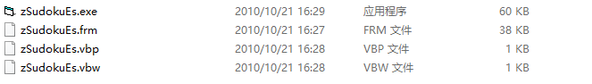

# zSudokuEsPro

这是一个非常古老的项目了。

`z` 是本人项目惯用起始字母，`sudoku` 是数独的意思，`es` 不知道，`pro` 是项目（Project）的意思。

********

项目采用 Visual Basic 6.0 编写，一款非常古老的编程语言，是打开我编程之门的另一把钥匙。

如果有开发环境，你知道点开哪一个文件。如果没有开发环境，你也知道点开哪一个文件。

********

很早以前想把项目放上来，但是能找到的代码并不是最新版本的。

********
